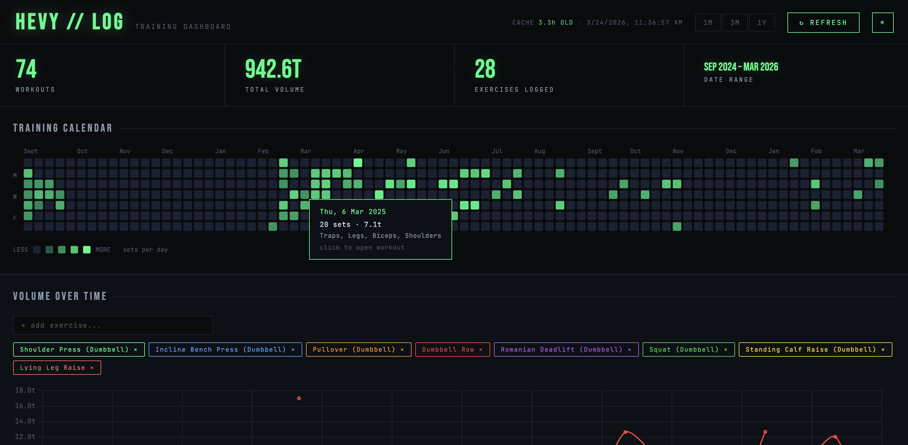
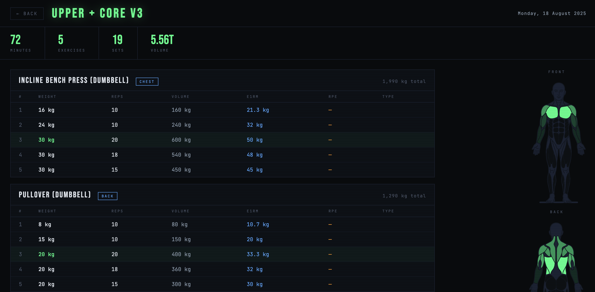

# Hevy Training Dashboard

A self-hosted dashboard for your [Hevy](https://hevy.com) workout data. Pulls your full training history via the Hevy API and gives you charts, muscle heatmaps, PR tracking, and next-session recommendations in one place.

**Note:** This is a personal project I built for my own training. It's shared as-is, and I'm not actively maintaining it or responding to issues. Feel free to fork it and adapt it to your needs though.





---

## Features

### Analytics

- Training calendar — GitHub-style heatmap showing every workout, hover to see volume and muscles trained
- Volume charts — Total weekly volume by exercise, filterable by time window (1M, 3M, 1Y)
- Strength progression — Estimated 1-rep max over time using the Epley formula
- Strength progress — Compare your e1RM and volume against 30 days ago
- Best time analysis — Scatter plot showing which days and times you tend to have your best sessions

### Personal Records

- PR tracking — Best weight, e1RM, and single-set volume for each exercise
- PR badges — Visual indicators on workout detail pages when you hit a new PR

### Training Recommendations

- Next session planner — Per-exercise suggestions based on when you last trained it
- Deload detection — Identifies high injury risk periods using ACWR (Acute to Chronic Workload Ratio)

### Muscle Analysis

- Muscle heatmaps — Visual body map colored by training volume and session frequency
- Secondary muscles — Accounts for which muscles assist in each exercise
- Splits recognition — Analyzes your training splits automatically from your history

### Detailed Views

- Exercise pages — Full progression history, PR records, and muscle contribution for each exercise
- Workout pages — Complete set-by-set breakdown for any past session
- Month view — Summary and muscle heatmap for any calendar month

### Other

- Dark mode — Full light/dark theme support
- Data export — Export next session recommendations as JSON
- Local database — All data stored offline in `hevy.db`, only syncs when you hit Refresh

---

## Requirements

- Python 3.10+
- A [Hevy](https://hevy.com) account
- A Hevy API key (available in the Hevy app settings)

---

## Installation

Clone the repo:

```bash
git clone https://github.com/bavadeve/hevy-dashboard.git
cd hevy-dashboard
```

### Option 1: Using venv (built-in)

```bash
python -m venv venv
source venv/bin/activate  # On Windows: venv\Scripts\activate
pip install -r requirements.txt
```

### Option 2: Using uv (faster)

```bash
uv venv
source .venv/bin/activate  # On Windows: .venv\Scripts\activate
uv pip install -r requirements.txt
```

### Set up your API key

Copy `.env.example` to `.env` and add your Hevy API key:

```bash
cp .env.example .env
```

Then edit `.env` and replace `your_api_key_here` with your actual API key from the Hevy app settings.

### Optional settings

Add any of these to `.env` to customize behavior:

```
FLASK_PORT=5000              # Server port (default: 5000)
FLASK_HOST=127.0.0.1         # Server host (default: 127.0.0.1, use 0.0.0.0 for network access)
FLASK_DEBUG=true             # Debug mode (default: true, set to false for production)
```

---

## Running

```bash
python app.py
```

Then open [http://127.0.0.1:5000](http://127.0.0.1:5000).

On first run, the app automatically fetches your full workout history from the Hevy API and stores it in `hevy.db`. After that, use the Refresh button in the UI to sync any new workouts. Subsequent refreshes are fast because only new data gets pulled.

---

## Project structure

```
hevy-dashboard/
├── app.py                  # Flask backend, Hevy API integration, data processing
├── hevy_db.py              # SQLite database layer and calculations
├── templates/
│   ├── index.html          # Main dashboard
│   ├── workout.html        # Workout detail page
│   ├── exercise.html       # Exercise detail page
│   └── month.html          # Month view page
├── static/
│   ├── js/                 # Dashboard interactivity (Chart.js visualizations, state)
│   ├── css/                # Styling for each page
│   └── muscles.svg         # Body map SVG for muscle heatmaps
├── hevy.db                 # SQLite database (auto-created on first run, gitignored)
├── .env                    # Your API key (gitignored, created from .env.example)
└── .env.example            # Configuration template (copy to .env)
```

---

## Configuration

You can adjust these constants in `app.py` if you want to fine-tune the dashboard:

| Constant | Default | Description |
|---|---|---|
| `TOP_N` | `8` | Number of exercises shown in charts and the PR panel |
| `STALE_DAYS` | `21` | Days without a session before an exercise is marked inactive |
| `UPPER_REP_TARGET` | `12` | Rep ceiling before the weight gets bumped |
| `WEIGHT_INCREMENT` | `2.0` | kg added on a weight bump (adjust for your equipment) |
| `REP_RESET_AFTER_BUMP` | `8` | Target reps after bumping weight |

---

## Muscle attribution

Volume is credited to both primary and secondary muscles. Secondary muscles get 50% of the primary volume by default, with per-exercise overrides in the `SECONDARY_WEIGHTS` dict in `app.py` for cases where the secondary involvement is clearly higher or lower.

Hevy uses `upper_back` as a catch-all, so the dashboard splits it into `traps` and `rhomboids` separately.

---

## Database

All workout data is stored in `hevy.db`. On refresh, only workouts newer than the latest one in the database are fetched — so subsequent refreshes are fast regardless of how much history you have.

---

## Notes

Not affiliated with or endorsed by Hevy.